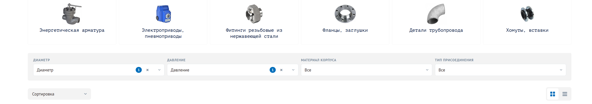
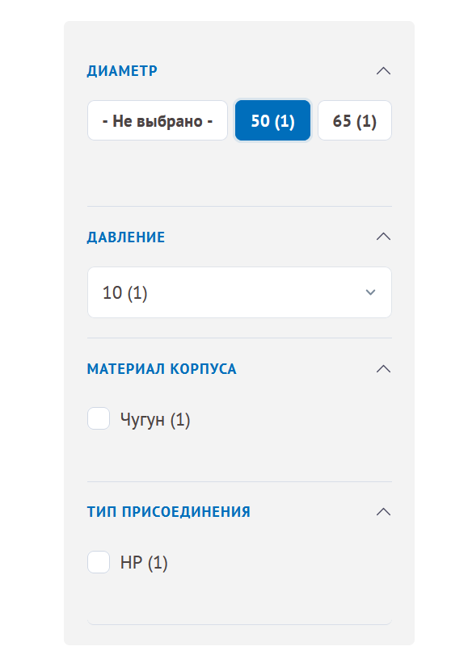
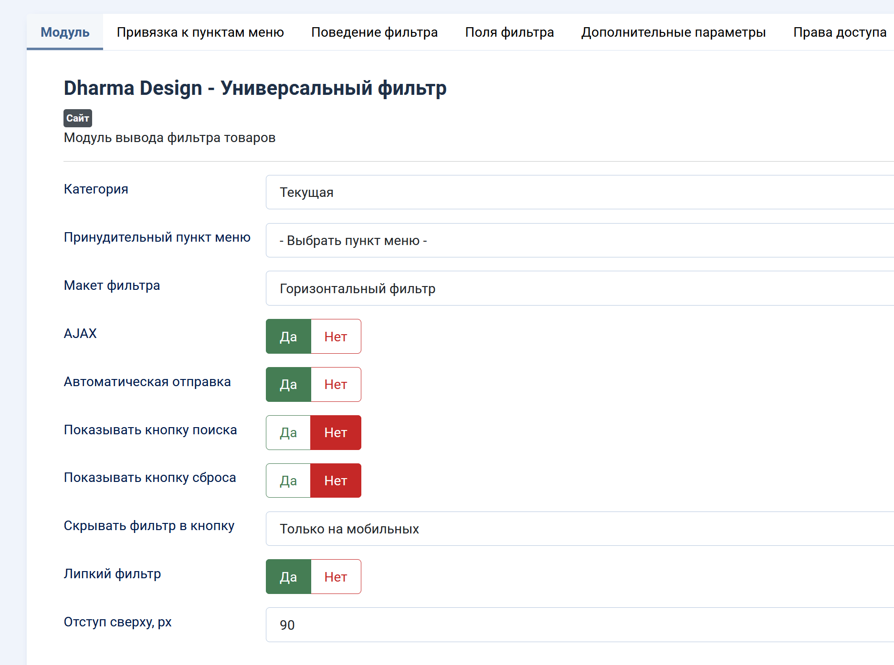
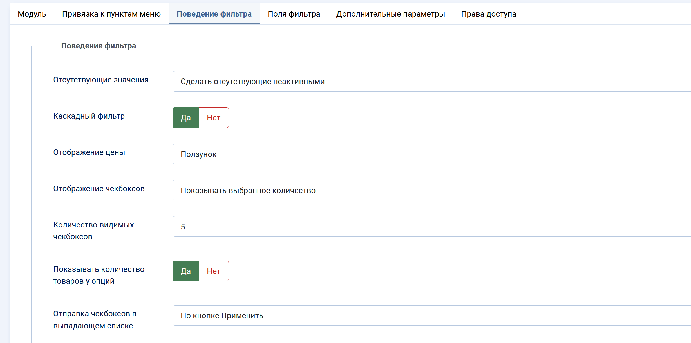
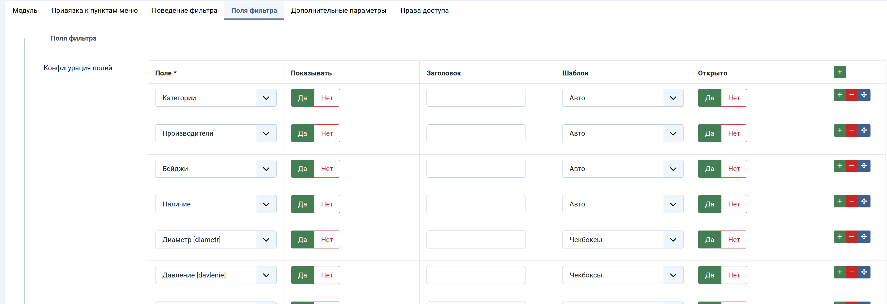

# Dharma Universal Filter

[](https://www.joomla.org/)
[](LICENSE)
[](https://github.com/shivayanamahom/dharma-universal-filter/releases)

Dharma Universal Filter is a Joomla 5/6 extension package for RadicalMart catalogs. It adds a configurable product filter module with indexed filter data, AJAX updates, vertical and horizontal layouts, offcanvas support, and scheduled reindexing.

The project is currently focused on real catalog pages where filters need to stay fast with many product fields, prices, categories, and option combinations.

## Screenshots

### Horizontal catalog filter



### Vertical catalog filter



### Administrator settings







## Package Contents

- `lib_dharma_universal_filter` - shared library with the `Indexer` class used by both plugins; owns the index database schema.
- `mod_dharma_universal_filter` - site module that renders the filter UI.
- `plg_system_dharma_universal_filter` - system plugin that keeps product index data up to date after product saves and exposes reindex tooling.
- `plg_task_dharma_universal_filter` - scheduled task plugin for full or incremental reindexing.
- `package/pkg_dharma_universal_filter.xml` - Joomla package manifest.
- `package/script.php` - package installer script that creates index tables and enables bundled plugins.

## Main Features

- RadicalMart product filtering by category fields and price.
- Indexed filter tables for faster available-option calculation.
- Vertical and horizontal module layouts.
- Field layouts for select, checkbox list, checkbox dropdown, radio buttons, price inputs, and price slider.
- AJAX filtering with optional instant apply or explicit apply button.
- Cascading availability logic that disables (or hides) values and whole fields that have no matching products for the current selection.
- Shared indexer with transactional, batched reindexing and automatic read-cache invalidation.
- Optional product counts next to filter values.
- Optional mobile/offcanvas filter mode.
- Optional sticky horizontal filter with configurable top offset.
- Russian and English language files.

## Documentation

- [Architecture](docs/architecture.md)
- [Roadmap](docs/roadmap.md)
- [OpenAI Codex for OSS application notes](docs/codex-for-oss.md)
- [Contributing](CONTRIBUTING.md)
- [Changelog](CHANGELOG.md)
- [Security policy](SECURITY.md)

## Requirements

- Joomla 5.x or 6.x compatible site.
- RadicalMart installed and configured.
- PHP version supported by the target Joomla version.
- MySQL/MariaDB with InnoDB.

## Repository Layout

```text
src/
  libraries/
    dharma_universal_filter/
  modules/
    mod_dharma_universal_filter/
  plugins/
    system/dharma_universal_filter/
    task/dharma_universal_filter/
package/
  pkg_dharma_universal_filter.xml
  script.php
build/
  build-package.ps1
```

## Build

From the repository root:

```powershell
powershell -ExecutionPolicy Bypass -File .\build\build-package.ps1
```

The script creates installable ZIP archives in `dist/`, including the package archive:

```text
dist/pkg_dharma_universal_filter_0.2.0.zip
```

## Installation

Install `dist/pkg_dharma_universal_filter_0.2.0.zip` through Joomla administrator:

```text
System -> Install -> Extensions
```

During installation/update the bundled library creates the index tables and the package script enables the system/task plugins.

> Filter output depends on the request query string, so the module ships with caching disabled. When upgrading an existing module instance, set its **Caching** to **No caching** in the module's Advanced tab, otherwise static module output caching will freeze the cascade.

## Development Notes

- Joomla 6 namespace compatibility is intentional. Do not introduce deprecated `J*` classes.
- Use `Joomla\Input\Input` and `Joomla\Filesystem\*` namespaces when direct imports are needed.
- Keep site-specific template overrides, demo media, caches, dumps, and Joomla configuration out of this repository.

## License

GPL-3.0-or-later. See `LICENSE`.
